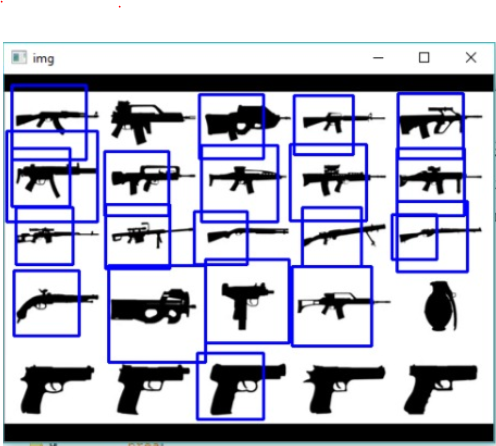

# opencv-gun-detection
### An opencv project to detect guns in different images.
For more details about opencv, head over to https://opencv.org
ABOUT:
CRIMINAL WEAPON IDENTIFICATION TECHNOLOGY CAN BE DEVELOPED USING OPENCV, AN OPEN SOURCE COMPUTER VISION LIBRARY. THIS TECHNOLOGY INVOLVES TRAINING MACHINE LEARNING ALGORITHMS TO IDENTIFY DIFFERENT TYPES OF WEAPONS, INCLUDING GUNS, KNIVES AND INVISIBLE OBJECTS, IN REAL-TIME VIDEO FOOTAGE. BY ANALYZING THE SHAPE, SIZE AND TEXTURE OF THE OBJECTS IN THE VIDEO, THE ALGORITHM CAN ACCURATELY IDENTIFY THE PRESENCE OF WEAPONS AND TRIGGER AN ALERT FOR THE AUTHORITIES TO TAKE ACTION. OPENCV PROVIDES POWERFUL TOOLS FOR IMAGE AND VIDEO PROCESSING, MAKING IT A GOOD CHOICE FOR CREATING POPULAR TECHNOLOGY TOOLS. BY NEXT FIXATION AND PROGRESS, THIS TECHNOLOGY MAY CAUSE PUBLIC STORAGE TO INCREASE AND HELP POLICE IDENTIFY DANGEROUS THREATS THAT CAN IDENTIFY THREATS.

### Sample of working project.

